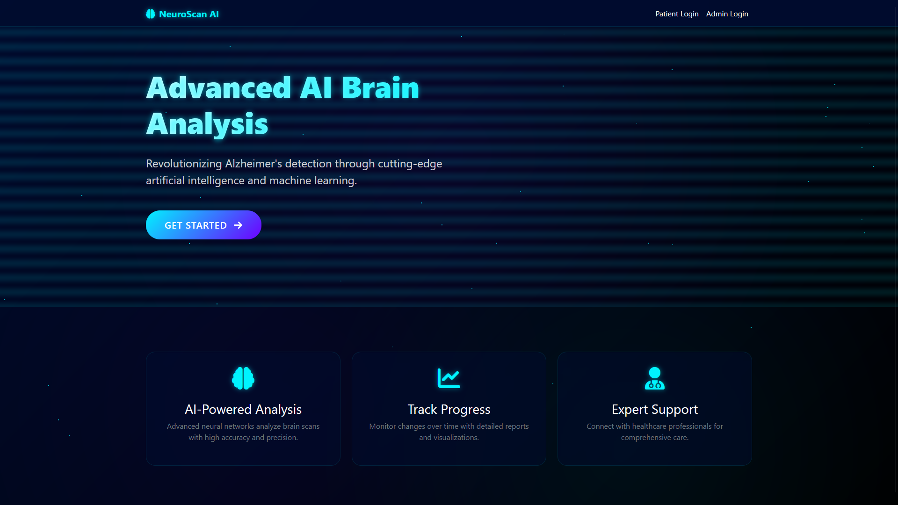
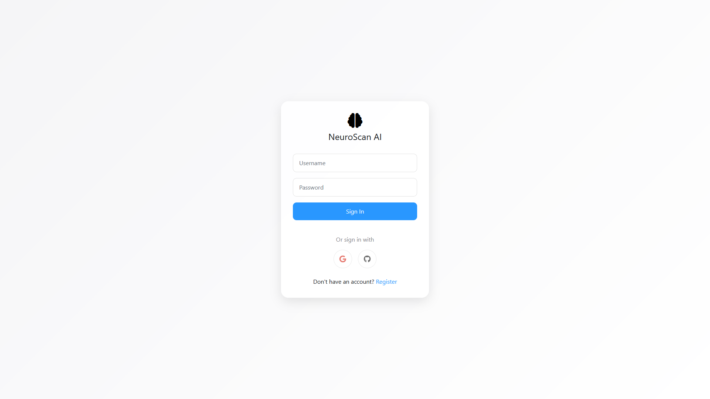
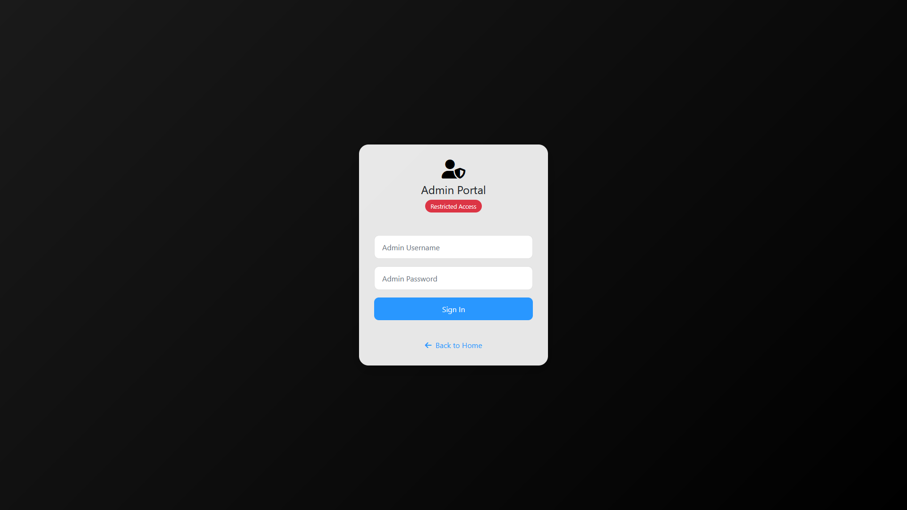

# NeuroScan: Early Detection of Dementia for Alzheimer's Diagnosis

## Description
NeuroScan is a cutting-edge AI-powered platform designed to detect dementia and assist in the early diagnosis of Alzheimer's disease. By analyzing brain imaging data, NeuroScan provides healthcare professionals with accurate predictions and actionable insights. This project combines advanced deep learning models with a user-friendly interface to streamline diagnostic workflows.

---

## Table of Contents
1. [Interface](#interface)
2. [Usage](#usage)
3. [Features](#features)
4. [Technologies Used](#technologies-used)
5. [Future Scope](#future-scope)
6. [Contributing](#contributing)
   

---

## Interface
NeuroScan features two primary interfaces:

### User Login Interface
The user login page allows healthcare professionals to securely access the platform using their credentials or third-party authentication options like Google or GitHub.

### Admin Portal
The admin portal is restricted to authorized personnel for managing system configurations, user accounts, and data security settings.

---

## Usage
Follow these steps to use NeuroScan:

1. **Sign In**: Log in using your credentials or third-party authentication options.
2. **Upload Data**: Upload MRI scans or other brain imaging data.
3. **Run Analysis**: Initiate the AI-powered analysis to detect dementia risks.
4. **View Results**: Access detailed predictions and visual insights through the dashboard.

For administrators:
- Use the admin portal to manage user accounts and system settings.

---

## Features
### **1. ResNet50-Based Dementia Classification**
NeuroScan uses a ResNet50 deep learning model trained on high-quality datasets to classify brain imaging data into four categories:
- **No Dementia**: Normal brain activity without signs of cognitive decline.
- **Very Mild Dementia**: Subtle symptoms indicating early-stage cognitive impairment.
- **Mild Dementia**: Noticeable cognitive decline affecting daily activities.
- **Moderate Dementia**: Significant impairments requiring assistance in daily tasks.

This multi-class classification ensures precise predictions for early intervention.

---

### **2. Secure Login System**
NeuroScan offers a secure login interface with two options:
- **Standard Login**: Username and password-based authentication.
- **Third-Party Authentication**: Integration with Google and GitHub for seamless access.

This ensures secure access to sensitive patient data while maintaining ease of use.

---

### **3. User-Friendly Dashboard**
The dashboard provides healthcare professionals with:
- Easy upload options for MRI scans or imaging data.
- Clear diagnostic results categorized by dementia severity.
- Visual insights such as heatmaps highlighting affected brain regions.

Its intuitive design ensures efficient navigation and usability.

---

### **4. Advanced Visualization Tools**
NeuroScan includes tools to help interpret predictions:
- Heatmaps generated by ResNet50 highlight regions of interest in brain scans.
- Statistical charts summarize patient trends over time.
- Comparative analysis between scans monitors disease progression.

These tools empower healthcare professionals with actionable insights.

---

### **5. Admin Control Panel**
The admin portal supports system management tasks such as:
- Managing user accounts and permissions.
- Configuring system updates and settings.
- Ensuring compliance with healthcare standards for data security.

This feature allows administrators to maintain system integrity as the platform scales.

---

### **6. High Accuracy and Reliability**
The ResNet50 model has been trained on datasets like ADNI (Alzheimer Disease Neuroimaging Initiative), ensuring:
- Robust performance across diverse imaging data.
- Minimal false positives or negatives in dementia detection.

NeuroScan's accuracy makes it a reliable tool for clinical use.

---

### **7. Scalable Design**
The platform is built to accommodate future expansions:
- Integration with additional datasets for improved accuracy across demographics.
- Support for non-imaging data like cognitive tests and patient history.
- Development of mobile applications for on-the-go diagnostics.

---

### **8. Privacy and Security**
NeuroScan adheres to strict privacy regulations (e.g., HIPAA compliance) to ensure sensitive patient information remains secure. Encryption protocols safeguard all uploaded imaging data.

---

### **9. Continuous Model Improvement**
The ResNet50 model is designed for continuous improvement through automated retraining mechanisms using new datasets and user feedback, ensuring its predictions remain accurate over time.

---

## Technologies Used
NeuroScan is built using:
- **Deep Learning Frameworks**: TensorFlow, PyTorch.
- **Programming Language**: Python.
- **Web Frameworks**: Flask/Django for backend development.
- **Frontend Design**: HTML, CSS, JavaScript for responsive UI.
- **Data Sources**: Alzheimer Disease Neuroimaging Initiative (ADNI) dataset.

---

## Future Scope
Planned enhancements include:
- Integration of additional datasets for broader applicability.
- Incorporation of non-imaging data like cognitive tests and patient history.
- Development of mobile applications for on-the-go diagnostics.
- Advanced visualization tools for deeper insights into predictions.

---

## Contributing
We welcome contributions from developers, researchers, and healthcare professionals! To contribute:

1. Fork the repository.
2. Create a feature branch:
