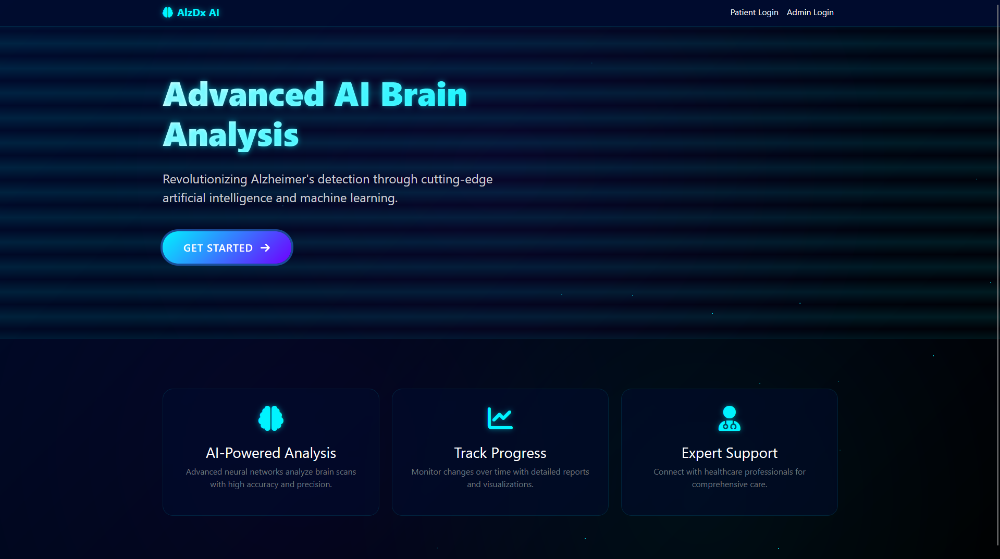
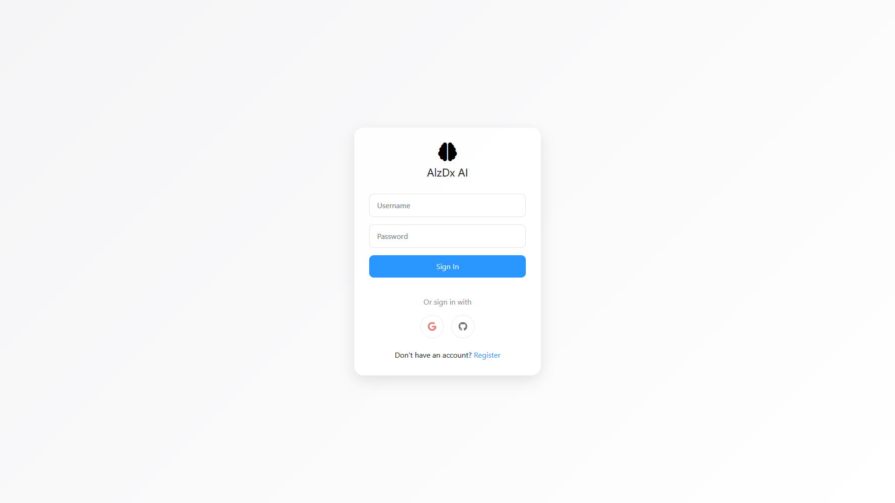
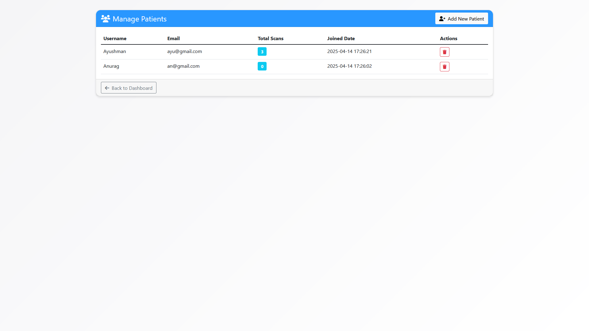

# AlzDx-AI : Early Detection of Dementia for Alzheimer's Diagnosis

## Description
AlzDx-AI  is a cutting-edge AI-powered platform designed to detect dementia and assist in the early diagnosis of Alzheimer's disease. By analyzing brain imaging data, AlzDx-AI  provides healthcare professionals with accurate predictions and actionable insights. This project combines advanced deep learning models with a user-friendly interface to streamline diagnostic workflows.

---

## Table of Contents
1. [Interface](#interface)
2. [Usage](#usage)
3. [Model](#model)
4. [Features](#features)
5. [Technologies Used](#technologies-used)
6. [Future Scope](#future-scope)
7. [Contributing](#contributing)
   

---

## Interface
AlzDx-AI  features two primary interfaces:

### User Login Interface
The user login page allows healthcare professionals to securely access the platform using their credentials or third-party authentication options like Google or GitHub.

### Admin Portal
The admin portal is restricted to authorized personnel for managing system configurations, user accounts, and data security settings.

Admin Login interface

Admin user management

---
## Model

---
## Usage
Follow these steps to use AlzDx-AI :

1. **Sign In**: Log in using your credentials or third-party authentication options.
2. **Upload Data**: Upload MRI scans or other brain imaging data.
3. **Run Analysis**: Initiate the AI-powered analysis to detect dementia risks.
4. **View Results**: Access detailed predictions and visual insights through the dashboard.

For administrators:
- Use the admin portal to manage user accounts and system settings.

---

## Features
#### **1. ResNet50-Based Dementia Classification**
AlzDx-AI  uses a ResNet50 deep learning model trained on high-quality datasets to classify brain imaging data into four categories:
- **No Dementia**: Normal brain activity without signs of cognitive decline.
- **Very Mild Dementia**: Subtle symptoms indicating early-stage cognitive impairment.
- **Mild Dementia**: Noticeable cognitive decline affecting daily activities.
- **Moderate Dementia**: Significant impairments requiring assistance in daily tasks.

This multi-class classification ensures precise predictions for early intervention.

---

#### **2. Secure Login System**
AlzDx-AI  offers a secure login interface with two options:
- **Standard Login**: Username and password-based authentication.
- **Third-Party Authentication**: Integration with Google and GitHub for seamless access.

This ensures secure access to sensitive patient data while maintaining ease of use.

---

#### **3. User-Friendly Dashboard**
The dashboard provides healthcare professionals with:
- Easy upload options for MRI scans or imaging data.
- Clear diagnostic results categorized by dementia severity.
- Visual insights such as heatmaps highlighting affected brain regions.

Its intuitive design ensures efficient navigation and usability.

---

#### **4. Advanced Visualization Tools**
AlzDx-AI  includes tools to help interpret predictions:
- Heatmaps generated by ResNet50 highlight regions of interest in brain scans.
- Statistical charts summarize patient trends over time.
- Comparative analysis between scans monitors disease progression.

These tools empower healthcare professionals with actionable insights.

---

#### **5. Admin Control Panel**
The admin portal supports system management tasks such as:
- Managing user accounts and permissions.
- Configuring system updates and settings.
- Ensuring compliance with healthcare standards for data security.

This feature allows administrators to maintain system integrity as the platform scales.

---

#### **6. High Accuracy and Reliability**
The ResNet50 model has been trained on datasets like ADNI (Alzheimer Disease Neuroimaging Initiative), ensuring:
- Robust performance across diverse imaging data.
- Minimal false positives or negatives in dementia detection.

AlzDx-AI 's accuracy makes it a reliable tool for clinical use.

---

#### **7. Scalable Design**
The platform is built to accommodate future expansions:
- Integration with additional datasets for improved accuracy across demographics.
- Support for non-imaging data like cognitive tests and patient history.
- Development of mobile applications for on-the-go diagnostics.

---

#### **8. Privacy and Security**
AlzDx-AI  adheres to strict privacy regulations (e.g., HIPAA compliance) to ensure sensitive patient information remains secure. Encryption protocols safeguard all uploaded imaging data.

---

#### **9. Continuous Model Improvement**
The ResNet50 model is designed for continuous improvement through automated retraining mechanisms using new datasets and user feedback, ensuring its predictions remain accurate over time.

---

## Technologies Used

#### **1. Deep Learning Frameworks**
AlzDx-AI  utilizes two powerful deep learning frameworks:
- **TensorFlow**: Provides scalability and production-ready capabilities for training the ResNet50 model efficiently.
- **PyTorch**: Offers dynamic computation graphs, making it ideal for experimentation during training phases.

---

#### **2. ResNet50 Architecture**
The core AI model is based on ResNet50, which uses residual connections to overcome vanishing gradients during training. It is adapted for multi-class classification of dementia stages.

---

#### **3. Dataset**
AlzDx-AI  relies on the Alzheimer Disease Neuroimaging Initiative (ADNI) dataset containing MRI scans, biomarkers, demographic details, and cognitive test results, ensuring high-quality predictions.

---

#### **4. Web Frameworks**
The platform is built using:
- **Flask**: Backend frameworks that handle API requests and user interactions efficiently.
- **HTML/CSS/JavaScript**: Frontend technologies used to create responsive interfaces.

---

#### **5. Visualization Tools**
Advanced tools like Grad-CAM (for heatmaps) and Plotly/Matplotlib (for charts) are used to present diagnostic results visually.

---

#### **6. Deployment Tools**
Docker containers ensure consistent environments across development stages, while cloud services like AWS provide scalability for hosting the application.

---

## Future Scope
Planned enhancements include:
- Integration of additional datasets for broader applicability.
- Incorporation of non-imaging data like cognitive tests and patient history.
- Development of mobile applications for on-the-go diagnostics.
- Advanced visualization tools for deeper insights into predictions.

---

## Contributing
We welcome contributions from developers, researchers, and healthcare professionals! To contribute:

1. Fork the repository.
2. Create a feature branch: 'git checkout -b feature-name'
3. Commit your changes and submit a pull request.

Please review our Contribution Guidelines before submitting your work.

---

## License
This project is licensed under the MIT License. See the [LICENSE](LICENSE.md) file for details.

---

## Contact
For inquiries or support:
- Email: masterdragonian@gmail.com 
